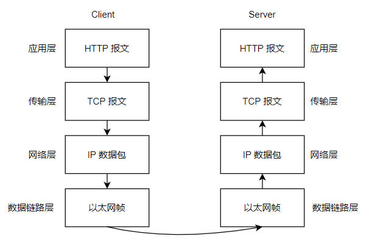
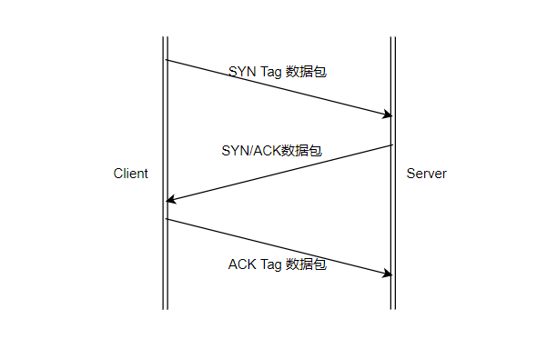

## 1.1 TCP/IP 四层协议
- 应用层
- 传输层
- 网络层
- 数据链路层
## 1.2 一个 HTTP 请求过程

## 1.3 三次握手
TCP 协议位于传输层，提供可靠的**字节流**服务。所谓字节流指的是将大块数据分割成以**报文段**为单位的数据包进行管理。而三次握手原理，就是为了将数据可靠地送达目标处。

- 发送端首先发送一个带有 `SYN` 标志的数据包给接收端。
- 接收端受到后回传一个带有 `SYN/ACK` 标志的数据包，表示确认。
- 发送端收到后再回传一个带有 `ACK` 标志的数据包，代表`握手`结束。
  

## 1.4 HTTP 协议
HTTP 协议用于客户端和服务端之间的通信。请求访问文本或图像资源的一端称为客户端，提供请求资源响应的一端称为服务端。HTTP 也是一种不保存状态协议，即无状态协议。HTTP 自身不对请求和响应之间的通信状态进行保存，也就是不做持久化处理。但是为了实现期望的保持状态功能，引入了 `Cookie` 技术来管理状态。

一段请求报文的格式是由请求方法、请求 URL、协议版本、可选的请求首部地址和内容实体构成的。

## 1.5 常见的请求方法
- GET：获取资源
  
  GET 方法用来请求访问已被 URL 识别的资源，指定的资源经服务端解析后返回响应。

- POST：传输实体主体
  
  GET 和 POST 方法都可以用来传输实体主体，但一般都不会使用 GET 方法。

- PUT ：传输文件
  
  如果请求报文中含有文件内容，可以使用 PUT 方法保存到请求 URL 指定的位置。

- HEAD ：获得报文首部
  
  HEAD 方法用于请求访问指定资源的报文首部，这是为了确认 URL 的有效性及资源更新的时间戳等。

- DELETE ：删除文件
  
  DELETE 方法用来请求 URL 删除指定的资源。

- OPTIONS ：询问支持的方法
  
  OPTIONS 方法用来查询针对请求 URL 指定的资源支持的方法。

- TRACE ：追踪路径

  TRACE 方法用来让服务端将之前的通信请求返回给客户端。

- CONNECT 方法：要求用隧道协议来连接代理

  CONNECT 方法要求在与代理服务器通信时建立隧道，实现用隧道协议进行 TCP 通信。常见的隧道协议有 SSL(Secure Socket Layer, 安全套接字)和TLS(Transport Layer Security, 传输层安全)

